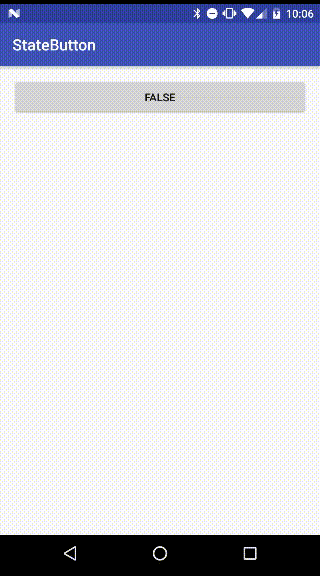

# StateButton
StateButton is an android library that the button compornet has a boolean value.

## Demo


## Usage
### XML
```xml
<net.yuzumone.statebutton.StateButton
    android:id="@+id/state_button"
    android:layout_width="match_parent"
    android:layout_height="wrap_content"
    />
```

### Attributes
```xml
<net.yuzumone.statebutton.StateButton
    app:state="true"
    app:trueString="True"
    app:falseString="Flase"
    app:trueStringRes="@string/true_string"
    app:falseStringRes="@string/false_string"
    />
```

## ButtonState
To set a init state of the button you use the setState functionality via xml or java. Default value is false.

### XML
```xml
app:state="true"
or
app:state="false"
```

### Java
```java
stateButton.setState(true);
or
stateButton.setState(false)
```

## ButtonText
To set text of the button you use the setTrueText or setFalseText functionality via xml or java. You can use String or String Resource.

### XML
```xml
app:trueString="True"
or
app:trueStringRes="@string/true_string"
```

### Java
```java
stateButton.setTrueString("True");
or
stateButton.setTrueStringRes();
```

## OnStateButtonListener
By setting a listener you will receive events accroding to the state.

```java
stateButton.setOnStateButtonListener(new OnStateButtonListener() {
    @Override
    public void trued(StateButton stateButton) {
    
    }

    @Override
    public void falsed(StateButton stateButton) {
    
    }
});
```

## License
```
Copyright 2017 yuzumone

Licensed under the Apache License, Version 2.0 (the "License");
you may not use this file except in compliance with the License.
You may obtain a copy of the License at

    http://www.apache.org/licenses/LICENSE-2.0

Unless required by applicable law or agreed to in writing, software
distributed under the License is distributed on an "AS IS" BASIS,
WITHOUT WARRANTIES OR CONDITIONS OF ANY KIND, either express or implied.
See the License for the specific language governing permissions and
limitations under the License.
```